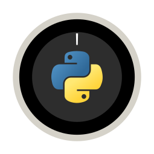

<a name="readme-top"></a>

<!-- PROJECT SHIELDS -->
<div align="center">

  <a href="">[![Stargazers][stars-shield]][stars-url]</a>
  <a href="">[![MIT License][license-shield]][license-url]</a>
  <a href="">[![Python][python.org]][python-url]</a>
  <a href="">[![LinkedIn][linkedin-shield]][linkedin-url]</a>
  <a href="">[![Github Pages][github-pages]][github-pages-url]</a>

</div>

<!-- PROJECT LOGO -->
<br />
<div align="center">
  <a href="https://github.com/MZZRD/NestPy">
    
  </a>

  <h3 align="center">NestPy</h3>

  <p align="center">
    A command line interface (cli) and module, written in python, for your controlling your Nest Thermostat
    <br />
    <a href="https://github.com/MZZRD/NestPy/issues/new?labels=bug&template=bug-report---.md">Report Bug</a>
    ·
    <a href="https://github.com/MZZRD/NestPy/issues/new?labels=enhancement&template=feature-request---.md">Request Feature</a>
  </p>
</div>


<!-- TABLE OF CONTENTS -->
<details>
  <summary>Table of Contents</summary>
  <ol>
    <li>
      <a href="#about-the-project">About The Project</a>
    </li>
    <li>
      <a href="#getting-started">Getting Started</a>
      <ul>
        <li><a href="#acquiring-sdm-api-credentials">Acquiring SDM API Credentials</a></li>
        <li><a href="#manual-package-install">Manual Package Install</a></li>
      </ul>
    </li>
    <li>
      <a href="#usage">Usage</a>
      <ul>
        <li><a href="#setting-temperature-setpoint">Setting Temperature Setpoint</a></li>
        <li><a href="#getting-traits">Getting Traits</a></li>
        <li><a href="#setting-thermostat-mode">Setting Thermostat Mode</a></li>
      </ul>
    </li>
    <li><a href="#license">License</a></li>
    <li><a href="#contact">Contact</a></li>
  </ol>
</details>


<!-- ABOUT THE PROJECT -->
## About The Project

This project is aimed at being a fun way for me to learn how to make CLI programs. As a bonus it deals with something I find very interesting, which is using code to influence the physical world. It's really exciting to be able to change the temperature in my room simply by typing commands in my terminal. 

The potential for automation and other projects is immense. Being a CLI program makes it easy to use in any programming language that can call shell commands. Additionally, the package can be imported into other Python scripts.

I've designed this project to fit my specific needs, so some features might be missing. However, the code is easily extendable, and I'm happy to include any contributions from others to complete this package.

<p align="right">(<a href="#readme-top">back to top</a>)</p>


<!-- GETTING STARTED -->
## Getting Started
Installation of this package comprises of two main steps, acruiring the smart device management (SDM) API credentials and manually installing and configuring the python package. These steps are outlined in the consequent sections respectively.

### Acquiring SDM API Credentials
Before you begin, you'll need to register for Device Access. This involves accepting the Google API and Device Access Sandbox Terms of Service, as well as paying a one-time, non-refundable fee of US$5 per account.

For detailed instructions and troubleshooting tips, please consult the [official guide](https://developers.google.com/nest/device-access/registration).

Next, create a project and obtain the required API keys/credentials by following the [Quick Start Guide](https://developers.google.com/nest/device-access/get-started).

Make sure to note down the following API keys/credentials for later use: project-id, device-id, access-token, refresh-token, oauth2-client-id, and oauth2-client-secret.

> [!NOTE]
> The refresh-token will expire after 7 days if the project is in testing mode. If this happens, follow the process outlined in [Google's Device Access Authorization Guide](https://developers.google.com/nest/device-access/authorize) to obtain a new access and refresh token. For more information on token expiration, refer to the [OAuth 2.0 Token Expiration documentation](https://developers.google.com/identity/protocols/oauth2#expiration).

### Manual Package Install

1. Clone the repository:
   ```sh
   git clone https://github.com/MZZRD/NestPy.git
   ```
2. Navigate to the directory
3. Install Python package:
   ```sh
   pip install .
   ```
4. Configure API keys/credentials by replacing the placeholders (...) with the corresponding values for each option:
   ```sh
   nestpy config \
     --project-id ... \
     --device-id ... \
     --access-token ... \
     --refresh-token ... \
     --oauth2-client-id ... \
     --oauth2-client-secret ...
   ```

<p align="right">(<a href="#readme-top">back to top</a>)</p>

<!-- USAGE EXAMPLES -->
## Usage

You can use the `--help` option to get information about the available commands and their options.

```txt
Usage: nestpy [OPTIONS] COMMAND [ARGS]...

Options:
  --version  Show the version and exit.
  --help     Show this message and exit.

Commands:
  config
  get
  mode
  set
```

Where `nestpy <COMMAND> --help` shows the options available for each command.

### Setting Temperature Setpoint
To set the temperature setpoint, use the `-t/--temperature` option followed by the desired temperature in Celsius:
```sh
nestpy set -t 23
```

### Getting Traits
The `get` command is used to get traits like the ambient humidity percentage `-h/--humidity`, ambient temperature `-t/--temperature`, temperature setpoint `-s/--setpoint` and thermostat mode `-m/--mode`. 

Multiple options can be chained together, like so:
```sh
nestpy get -htsm
```
This command outputs:
```txt
65 20.75 20.5 HEAT
```
The values are printed inline, separated by a space character. Chaining options like this is faster than retrieving each option individually, as it only requires a single API request instead of multiple."

### Setting Thermostat Mode
The `mode` command is used to set the thermostat mode to either OFF `-o/--off`, MANUAL_ECO `-e/--eco` and HEAT `-h/--heat`.

For instance, running the command:

```sh
nestpy mode -h
```

sets the thermostat mode to HEAT.

> [!NOTE]
> When the thermostat mode is set to MANUAL_ECO, it's not possible to retrieve information about the current temperature setpoint, nor is it possible to adjust it. To access information about the temperature setpoint again, switch the thermostat mode to HEAT.

<p align="right">(<a href="#readme-top">back to top</a>)</p>


<!-- LICENSE -->
## License

Distributed under the MIT License. See `LICENSE` for more information.

<p align="right">(<a href="#readme-top">back to top</a>)</p>


<!-- CONTACT -->
## Contact

Maarten ten Voorde - [LinkedIn][linkedin-url] - m.tenvoorde1998@gmail.com

Project Link: [https://github.com/MZZRD/NestPy](https://github.com/MZZRD/NestPy)

<p align="right">(<a href="#readme-top">back to top</a>)</p>


<!-- MARKDOWN LINKS & IMAGES -->
[stars-shield]: https://img.shields.io/github/stars/MZZRD/NestPy.svg?style=for-the-badge
[stars-url]: https://github.com/MZZRD/NestPy/stargazers
[license-shield]: https://img.shields.io/github/license/MZZRD/NestPy.svg?style=for-the-badge
[license-url]: https://github.com/MZZRD/NestPy/blob/main/LICENSE
[linkedin-shield]: https://img.shields.io/badge/LinkedIn-0077B5?style=for-the-badge&logo=linkedin&logoColor=white
[linkedin-url]: https://www.linkedin.com/in/maarten-ten-voorde-jb/
[python.org]: https://img.shields.io/badge/Python-3776AB?style=for-the-badge&logo=python&logoColor=white
[python-url]: https://python.org
[github-pages]: https://img.shields.io/badge/about%20me-121013?style=for-the-badge&logo=github&logoColor=white
[github-pages-url]: https://MZZRD.github.io
