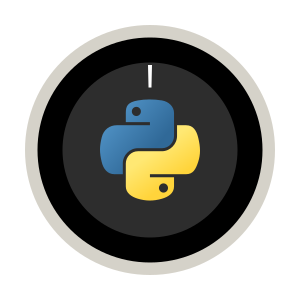

<a name="readme-top"></a>

<!-- PROJECT SHIELDS -->
<div align="center">

  <a href="">[![Stargazers][stars-shield]][stars-url]</a>
  <a href="">[![MIT License][license-shield]][license-url]</a>
  <a href="">[![Python][python.org]][python-url]</a>
  <a href="">[![LinkedIn][linkedin-shield]][linkedin-url]</a>
  <a href="">[![Github Pages][github-pages]][github-pages-url]</a>

</div>

<!-- PROJECT LOGO -->
<br />
<div align="center">
  <a href="https://github.com/MZZRD/NestPy">
    
  </a>

  <h3 align="center">NestPy</h3>

  <p align="center">
    A command line interface (cli) and module, written in python, for your controlling your Nest Thermostat
    <br />
    <a href="https://github.com/MZZRD/NestPy/issues/new?labels=bug&template=bug-report---.md">Report Bug</a>
    ·
    <a href="https://github.com/MZZRD/NestPy/issues/new?labels=enhancement&template=feature-request---.md">Request Feature</a>
  </p>
</div>


<!-- TABLE OF CONTENTS -->
<details>
  <summary>Table of Contents</summary>
  <ol>
    <li>
      <a href="#about-the-project">About The Project</a>
      <ul>
        <li><a href="#built-with">Built With</a></li>
      </ul>
    </li>
    <li>
      <a href="#getting-started">Getting Started</a>
      <ul>
        <li><a href="#prerequisites">Prerequisites</a></li>
        <li><a href="#installation">Installation</a></li>
      </ul>
    </li>
    <li><a href="#usage">Usage</a></li>
    <li><a href="#roadmap">Roadmap</a></li>
    <li><a href="#contributing">Contributing</a></li>
    <li><a href="#license">License</a></li>
    <li><a href="#contact">Contact</a></li>
    <li><a href="#acknowledgments">Acknowledgments</a></li>
  </ol>
</details>


<!-- ABOUT THE PROJECT -->
## About The Project

There are many great README templates available on GitHub; however, I didn't find one that really suited my needs so I created this enhanced one. I want to create a README template so amazing that it'll be the last one you ever need -- I think this is it.

Here's why:
* Your time should be focused on creating something amazing. A project that solves a problem and helps others
* You shouldn't be doing the same tasks over and over like creating a README from scratch
* You should implement DRY principles to the rest of your life :smile:

Of course, no one template will serve all projects since your needs may be different. So I'll be adding more in the near future. You may also suggest changes by forking this repo and creating a pull request or opening an issue. Thanks to all the people have contributed to expanding this template!

Use the `BLANK_README.md` to get started.

<p align="right">(<a href="#readme-top">back to top</a>)</p>

<!-- GETTING STARTED -->
## Getting Started
Installation of this package comprises of two main steps, acruiring the smart device management (SDM) API credentials and manually installing and configuring the python package. These steps are outlined in the consequent sections respectively.

### Acquiring SDM API Credentials
Before you begin, you'll need to register for Device Access. This involves accepting the Google API and Device Access Sandbox Terms of Service, as well as paying a one-time, non-refundable fee of US$5 per account.

For detailed instructions and troubleshooting tips, please consult the [official guide](https://developers.google.com/nest/device-access/registration).

Next, create a project and obtain the required API keys/credentials by following the [Quick Start Guide](https://developers.google.com/nest/device-access/get-started).

Make sure to note down the following API keys/credentials for later use: project-id, device-id, access-token, refresh-token, oauth2-client-id, and oauth2-client-secret.

> [!NOTE]
> The refresh-token will expire after 7 days if the project is in testing mode. If this happens, follow the process outlined in [Google's Device Access Authorization Guide](https://developers.google.com/nest/device-access/authorize) to obtain a new access and refresh token. For more information on token expiration, refer to the [OAuth 2.0 Token Expiration documentation](https://developers.google.com/identity/protocols/oauth2#expiration).

### Manual Package Install

1. Clone the repository:
   ```sh
   git clone https://github.com/MZZRD/NestPy.git
   ```
2. Navigate to the directory
3. Install Python requirements:
   ```sh
   pip install -r requirements.txt
   ```
4. Configure API keys/credentials by replacing the placeholders (...) with the corresponding values for each option:
   ```sh
   nestpy config \
     --project-id ... \
     --device-id ... \
     --access-token ... \
     --refresh-token ... \
     --oauth2-client-id ... \
     --oauth2-client-secret ...
   ```

<p align="right">(<a href="#readme-top">back to top</a>)</p>

<!-- USAGE EXAMPLES -->
## Usage

You can use the `--help` option to get information about the available commands and their options.

```txt
Usage: nestpy [OPTIONS] COMMAND [ARGS]...

Options:
  --version  Show the version and exit.
  --help     Show this message and exit.

Commands:
  config
  get
  mode
  set
```

Where `nestpy <COMMAND> --help` shows the options available for each command.

### Setting Temperature Setpoint
To set the temperature setpoint, use the `-t` option followed by the desired temperature in Celsius:
```sh
nestpy set -t 23
```

### Getting Traits
The `get` command is used to get traits like the ambient humidity percentage `-h/--humidity`, ambient temperature `-t/--temperature`, temperature setpoint `-s/--setpoint` and thermostat mode `-m/--mode`. 

Multiple options can be chained together, like so:
```sh
nestpy get -htsm
```
This command outputs:
```txt
65 20.75 20.5 HEAT
```
The values are printed inline, separated by a space character. Chaining options like this is faster than retrieving each option individually, as it only requires a single API request instead of multiple."

### Setting Thermostat Mode
The `mode` command is used to set the thermostat mode to either OFF `-o/--off`, MANUAL_ECO `-e/--eco` and HEAT `-h/--heat`.

For instance, running the command:

```sh
nestpy mode -h
```

sets the thermostat mode to HEAT.

> [!NOTE]
> When the thermostat mode is set to MANUAL_ECO, it's not possible to retrieve information about the current temperature setpoint, nor is it possible to adjust it. To access information about the temperature setpoint again, switch the thermostat mode to HEAT.

<p align="right">(<a href="#readme-top">back to top</a>)</p>


<!-- ROADMAP -->
## Roadmap

- [x] Add Changelog
- [x] Add back to top links
- [ ] Add Additional Templates w/ Examples
- [ ] Add "components" document to easily copy & paste sections of the readme
- [ ] Multi-language Support
    - [ ] Chinese
    - [ ] Spanish

See the [open issues](https://github.com/MZZRD/NestPy/issues) for a full list of proposed features (and known issues).

<p align="right">(<a href="#readme-top">back to top</a>)</p>


<!-- CONTRIBUTING -->
## Contributing

Contributions are what make the open source community such an amazing place to learn, inspire, and create. Any contributions you make are **greatly appreciated**.

If you have a suggestion that would make this better, please fork the repo and create a pull request. You can also simply open an issue with the tag "enhancement".
Don't forget to give the project a star! Thanks again!

1. Fork the Project
2. Create your Feature Branch (`git checkout -b feature/AmazingFeature`)
3. Commit your Changes (`git commit -m 'Add some AmazingFeature'`)
4. Push to the Branch (`git push origin feature/AmazingFeature`)
5. Open a Pull Request

<p align="right">(<a href="#readme-top">back to top</a>)</p>


<!-- LICENSE -->
## License

Distributed under the MIT License. See `LICENSE.txt` for more information.

<p align="right">(<a href="#readme-top">back to top</a>)</p>


<!-- CONTACT -->
## Contact

Your Name - [@your_twitter](https://twitter.com/your_username) - email@example.com

Project Link: [https://github.com/your_username/repo_name](https://github.com/your_username/repo_name)

<p align="right">(<a href="#readme-top">back to top</a>)</p>


<!-- ACKNOWLEDGMENTS -->
## Acknowledgments

Use this space to list resources you find helpful and would like to give credit to. I've included a few of my favorites to kick things off!

* [Choose an Open Source License](https://choosealicense.com)
* [GitHub Emoji Cheat Sheet](https://www.webpagefx.com/tools/emoji-cheat-sheet)
* [Malven's Flexbox Cheatsheet](https://flexbox.malven.co/)
* [Malven's Grid Cheatsheet](https://grid.malven.co/)
* [Img Shields](https://shields.io)
* [GitHub Pages](https://pages.github.com)
* [Font Awesome](https://fontawesome.com)
* [React Icons](https://react-icons.github.io/react-icons/search)

<p align="right">(<a href="#readme-top">back to top</a>)</p>


<!-- MARKDOWN LINKS & IMAGES -->
<!-- https://www.markdownguide.org/basic-syntax/#reference-style-links -->
[contributors-shield]: https://img.shields.io/github/contributors/MZZRD/NestPy.svg?style=for-the-badge
[contributors-url]: https://github.com/MZZRD/NestPy/graphs/contributors
[forks-shield]: https://img.shields.io/github/forks/MZZRD/NestPy.svg?style=for-the-badge
[forks-url]: https://github.com/MZZRD/NestPy/network/members
[stars-shield]: https://img.shields.io/github/stars/MZZRD/NestPy.svg?style=for-the-badge
[stars-url]: https://github.com/MZZRD/NestPy/stargazers
[issues-shield]: https://img.shields.io/github/issues/MZZRD/NestPy.svg?style=for-the-badge
[issues-url]: https://github.com/MZZRD/NestPy/issues
[license-shield]: https://img.shields.io/github/license/MZZRD/NestPy.svg?style=for-the-badge
[license-url]: https://github.com/MZZRD/NestPy/blob/master/LICENSE.txt
[linkedin-shield]: https://img.shields.io/badge/LinkedIn-0077B5?style=for-the-badge&logo=linkedin&logoColor=white
[linkedin-url]: https://linkedin.com/in/othneildrew
[product-screenshot]: images/screenshot.png
[Next.js]: https://img.shields.io/badge/next.js-000000?style=for-the-badge&logo=nextdotjs&logoColor=white
[Next-url]: https://nextjs.org/
[React.js]: https://img.shields.io/badge/React-20232A?style=for-the-badge&logo=react&logoColor=61DAFB
[React-url]: https://reactjs.org/
[Vue.js]: https://img.shields.io/badge/Vue.js-35495E?style=for-the-badge&logo=vuedotjs&logoColor=4FC08D
[Vue-url]: https://vuejs.org/
[Angular.io]: https://img.shields.io/badge/Angular-DD0031?style=for-the-badge&logo=angular&logoColor=white
[Angular-url]: https://angular.io/
[Svelte.dev]: https://img.shields.io/badge/Svelte-4A4A55?style=for-the-badge&logo=svelte&logoColor=FF3E00
[Svelte-url]: https://svelte.dev/
[Laravel.com]: https://img.shields.io/badge/Laravel-FF2D20?style=for-the-badge&logo=laravel&logoColor=white
[Laravel-url]: https://laravel.com
[Bootstrap.com]: https://img.shields.io/badge/Bootstrap-563D7C?style=for-the-badge&logo=bootstrap&logoColor=white
[Bootstrap-url]: https://getbootstrap.com
[JQuery.com]: https://img.shields.io/badge/jQuery-0769AD?style=for-the-badge&logo=jquery&logoColor=white
[JQuery-url]: https://jquery.com 
[python.org]: https://img.shields.io/badge/Python-3776AB?style=for-the-badge&logo=python&logoColor=white
[python-url]: https://python.org
[github-pages]: https://img.shields.io/badge/about%20me-121013?style=for-the-badge&logo=github&logoColor=white
[github-pages-url]: https://MZZRD.github.io
